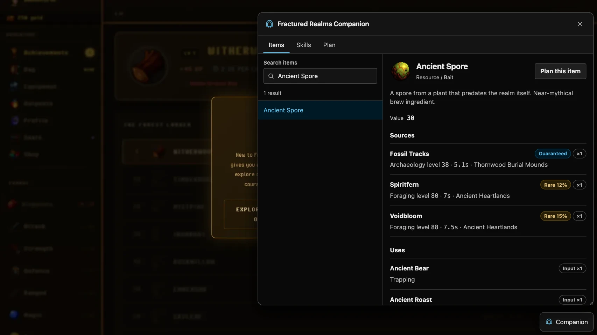
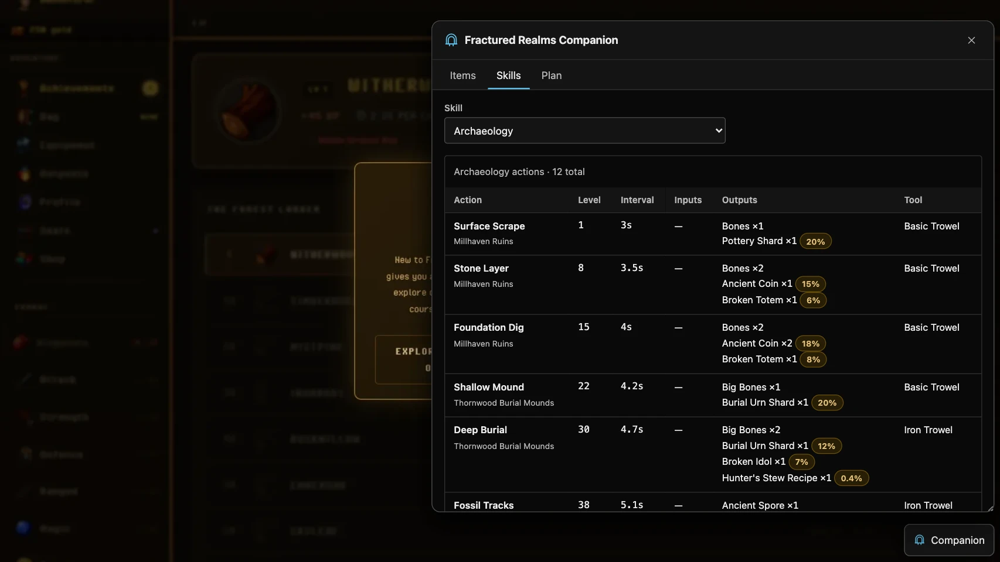
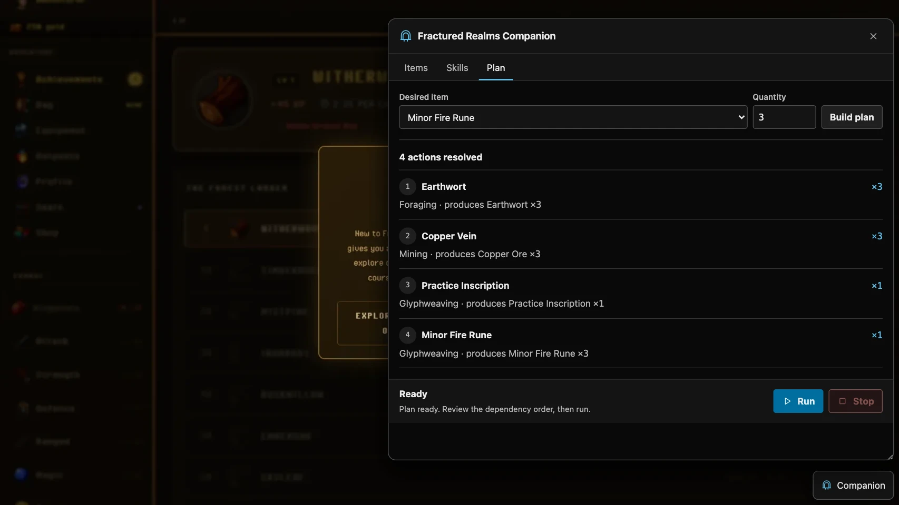
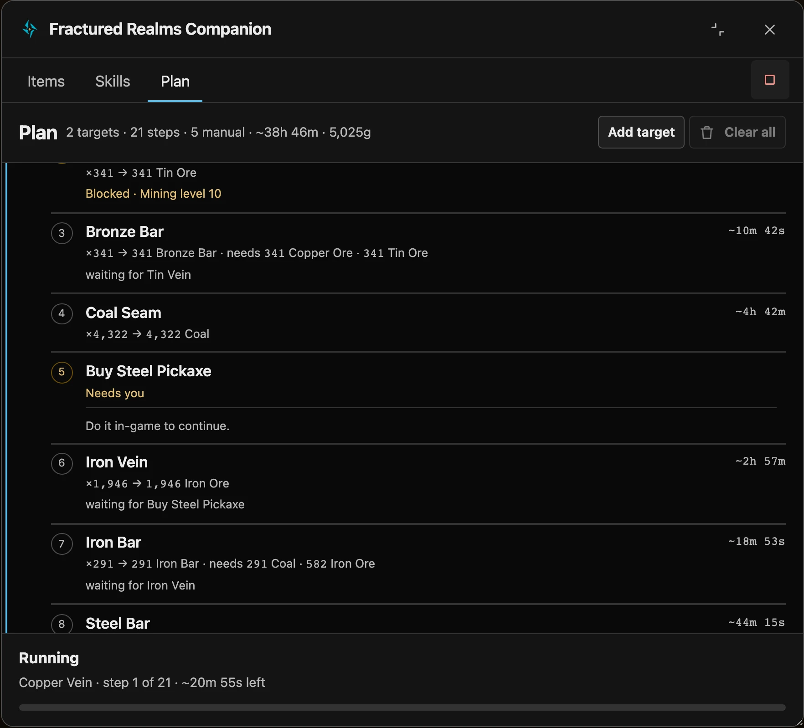

<p align="center">
  
</p>

<h1 align="center">Fractured Realms Companion</h1>

<p align="center">
  A local item wiki and action planner for <strong><a href="https://store.steampowered.com/app/3789070/Fractured_Realms/">Fractured Realms</a></strong>.
  Find what you need, understand the dependencies, and start the next valid action without leaving the game.
</p>

<p align="center">
  <a href="#installation">Install</a> ·
  <a href="#quickstart">Try it</a> ·
  <a href="docs/screenshots/action-planner.webp">See the planner</a>
</p>

<table>
  <tr>
    <td><strong>Item wiki</strong><br>Search for sources, uses, stats, requirements, and artwork.</td>
    <td><strong>Dependency planning</strong><br>Turn a typed target into a visible, prioritized timeline from live inventory.</td>
    <td><strong>Direct actions</strong><br>Run one game action at a time with progress, blockers, and stop controls.</td>
  </tr>
</table>

### Companion preview

| Item wiki | Compiled skill actions |
| --- | --- |
| Search an item, then inspect its sources, uses, stats, and artwork. | Compare action levels, timings, tools, outputs, and drop rates. |
|  |  |

### Planning preview



Manual steps stay visible in the timeline with a "waiting on you" badge and a wall-clock ready-at estimate, so you know when to come back for a purchase or build.



## What it does

- **Items:** Search by item name for sources, uses, stats, requirements, and artwork.
- **Skills:** Compare action levels, timings, tools, inputs, outputs, rare outputs, and locations.
- **Planning:** Build typed targets for item totals or gains, skill levels or XP, action runs or minutes, unlocks, and gold. The engine resolves prerequisites into a prioritized step timeline against live state.
- **Queue:** Review one prioritized timeline. Manual instruction cards remain visible with their wall-clock ready-at estimate; independent runnable steps continue while a manual or blocked step waits.
- **Executor:** Run the highest-priority startable action, preempt it when a higher-priority step becomes startable, and surface running, waiting, blocked, complete, and error states without bypassing game checks.
- **Local data:** `refresh` compiles the installed game's registries into one `model.json` (pack schema version 2) and writes a derived `model.db` projection in the state directory when a built-in SQLite driver is available.

<details>
<summary>Feature details</summary>

- **Planning resolution:** Targets are typed as item, item-gain, level, XP, action, unlock, or gold goals. The engine resolves prerequisites and emits a prioritized timeline; each step reports its purpose, expected duration, and live scheduler status. Manual steps become instruction cards with a wall-clock ready-at estimate, while independent automatable steps continue.
- **Stochastic sources:** Rare drops and other probabilistic outputs are estimates, not guarantees. Steps that depend on them stop from observed live state rather than predicted counts.
- **Direct execution:** The executor checks live start requirements, runs the highest-priority action that is currently startable, preempts lower-priority work when needed, and surfaces refusals and stalls. Manual steps never block independent work and are never auto-completed by the companion.
- **Live scheduler:** The queue preserves target priority while choosing the highest-priority action that is startable in the current live state. A newly available higher-priority action preempts lower-priority work; manual instruction cards do not pause independent actions.
- **Local data:** `refresh` compiles the installed game's registries into one `model.json` (pack schema version 2) and writes a derived `model.db` projection in the state directory when a built-in SQLite driver is available.

</details>

## Inspecting the compiled game model

After `refresh`, inspect the canonical model JSON and its optional SQLite projection without launching the game:

```sh
fractured-companion model info
fractured-companion model sql "SELECT id, level_req FROM actions WHERE skill_id='woodcutting' ORDER BY level_req LIMIT 3"
```

`model info` reports the build, schema version, registry counts, and paths. `model sql` accepts read-only `SELECT` statements and prints one JSON object per row from `<stateDir>/model.db`. The projection is derived from `<stateDir>/pack/data/model.json`; if the database or a built-in SQLite driver is unavailable, run `refresh` and check the reported error. The overlay serves the same model at `http://127.0.0.1:48766/companion/data/model.json` when the companion host is running.

## Publishing the data spreadsheet

Maintainers can publish the compiled model to a Google Spreadsheet (one tab per model table, lossless) so others can theorycraft and build on the data. The `scripts/export-sheets.mjs` publisher reads `<stateDir>/model.db` (populated by `refresh`), signs a Google service-account JWT with `node:crypto`, and writes each table through the Google Sheets REST API. It adds no runtime dependency.

Preview offline without any Google setup:

```sh
npm run export-sheets -- --dry-run
```

This lists every tab with its row and cell counts and writes nothing.

To publish, do the one-time Google setup:

1. In the [Google Cloud Console](https://console.cloud.google.com), create or select a project and enable the **Google Sheets API**.
2. Create a **service account**, add a **JSON key**, and download it.
3. Save the key at `~/.config/fractured-realms-companion/google-credentials.json` (or point `FRACTURED_SHEETS_CREDENTIALS` at another path).
4. Create a spreadsheet and **share it (Editor) with the service-account email**.

Then publish, passing the spreadsheet id from its URL the first time only:

```sh
FRACTURED_SHEETS_SPREADSHEET_ID=<spreadsheet-id> npm run export-sheets
```

The id is remembered in the config dir (`~/.config/fractured-realms-companion/spreadsheet-id`), so subsequent publishes need only `npm run export-sheets`. Pass the env var again any time to target a different sheet.

Each run creates any missing tabs, clears and rewrites every model table, and freezes plus bolds the header row. Tabs are only added or updated, never deleted, so your own analysis tabs survive a republish. Writes that hit Google's per-minute quota are retried with exponential backoff so every tab lands; any remaining per-tab failures are reported without aborting the batch.

## Requirements

- Fractured Realms Steam app `3789070` must be installed in a Steam library the companion can discover.
- The npm and npx paths require Node.js 20 or newer.
- Standalone release binaries include their runtime and require neither Node.js nor Bun.
- Linux launch support requires the `steam` command or a detected Flatpak Steam installation.
- macOS discovery targets Steam in a CrossOver bottle and expects the CrossOver `wine` launcher at `/Applications/CrossOver.app/Contents/SharedSupport/CrossOver/bin/wine`. Native macOS Fractured Realms installations are not a discovery target.

## Installation

Choose the npm package, npx, or one standalone release binary.

| Path | Install or download | Run |
| --- | --- | --- |
| npm, global | `npm install --global fractured-realms-companion` | `fractured-companion <command>` |
| npx, one-off | No installation | `npx --yes fractured-realms-companion <command>` |
| Windows x64 | Download [`fractured-companion-windows-x64`](https://github.com/glockyco/fractured-realms-companion/releases/latest) | `fractured-companion-windows-x64.exe <command>` |
| Linux x64 | Download [`fractured-companion-linux-x64`](https://github.com/glockyco/fractured-realms-companion/releases/latest) | `chmod +x ./fractured-companion-linux-x64` then `./fractured-companion-linux-x64 <command>` |
| macOS Apple silicon | Download [`fractured-companion-darwin-arm64`](https://github.com/glockyco/fractured-realms-companion/releases/latest) | `chmod +x ./fractured-companion-darwin-arm64` then `./fractured-companion-darwin-arm64 <command>` |
| macOS Intel | Download [`fractured-companion-darwin-x64`](https://github.com/glockyco/fractured-realms-companion/releases/latest) | `chmod +x ./fractured-companion-darwin-x64` then `./fractured-companion-darwin-x64 <command>` |

Every release includes `SHA256SUMS`. Download it beside the binary, then verify before running:

```sh
# Linux
sha256sum -c SHA256SUMS

# macOS
shasum -a 256 -c SHA256SUMS
```

The macOS binaries are unsigned. If macOS blocks one, try launching it once, open **System Settings → Privacy & Security**, and choose **Open Anyway** for that specific binary. Do not disable Gatekeeper globally or apply a permanent bypass. If local policy prohibits unsigned executables, use npm or npx instead.

## Quickstart

These examples use the globally installed command. An installed package, an npx invocation, or a downloaded binary invoked from `PATH` or by absolute path can be run from any directory.

Treat the first check as a diagnostic sequence:

```sh
fractured-companion doctor --json
fractured-companion refresh
fractured-companion doctor
fractured-companion launch
```

The first `doctor --json` is read-only. Before the first refresh it may report expected failures for missing extracted data, patch metadata, or companion state. `refresh` then extracts the current game data and patches the archive by default. Run `doctor` again and proceed to `launch` only when it reports no blocking failures.

`launch` runs the already-refreshed companion. It starts Fractured Realms with the companion flag, waits for the local host to become healthy, and opens `http://127.0.0.1:48766/`. It does not perform a refresh.

## Commands and options

| Command | Behavior | Command-specific option |
| --- | --- | --- |
| `doctor` | Read-only diagnostics for the install, state, patch, and local host | `--json` emits diagnostic rows as JSON |
| `refresh` | Extract current game data and update the companion patch | `--no-patch` extracts and validates without changing the archive |
| `restore` | Restore the verified original game archive | None |
| `launch` | Run the already-refreshed companion | `--no-open` leaves the browser closed |
| `relaunch` | Quit the project-owned running companion, refresh, and launch | `--no-open` leaves the browser closed |

Common options must follow the command:

- `--steam-root PATH` selects an explicit Steam root.
- `--bottle NAME` selects a CrossOver bottle on macOS. The default is `Steam`.

Examples:

```sh
fractured-companion doctor --steam-root "/path/to/Steam" --json
fractured-companion refresh --steam-root "/path/to/Steam" --no-patch
fractured-companion launch --bottle MySteam --no-open
```

Global help and version output are also available:

```sh
fractured-companion --help
fractured-companion --version
```

## Steam discovery

The companion checks these default Steam roots, then follows additional libraries from `steamapps/libraryfolders.vdf`.

| System | Steam installation searched |
| --- | --- |
| Windows | `%ProgramFiles(x86)%\Steam`, `%ProgramFiles%\Steam`, then the current user's Steam registry path |
| Linux | `~/.local/share/Steam`, `~/.steam/steam`, and `~/.var/app/com.valvesoftware.Steam/.local/share/Steam` |
| macOS | `~/Library/Application Support/CrossOver/Bottles/<bottle>/drive_c/Program Files (x86)/Steam` |

Use `--steam-root PATH` for a non-standard root. On macOS, use `--bottle NAME` when Steam is not in the default `Steam` bottle.

## Updating, relaunching, and restoring

If `launch` reports that a companion with an outdated revision is running, use:

```sh
fractured-companion relaunch
```

`relaunch` requests shutdown only from the project-owned companion, waits up to 30 seconds, refreshes, and launches. If the game does not exit within that shutdown window, close it manually and retry.

After a Steam update replaces the archive or build ID, run:

```sh
fractured-companion refresh
fractured-companion doctor
fractured-companion launch
```

If changed source anchors make the new build unsafe to patch, `refresh` stops before writing. Do not force the patch.

To restore the original archive:

```sh
fractured-companion restore
```

Restore is guarded by the Steam build metadata, companion marker, installed patched fingerprint, and verified immutable backup. It refuses mismatched or unknown state.

### External legacy prerequisite

If the separate `crossover-electron-bridge` project previously patched Fractured Realms, restore that archive from its own `crossover-browser-games` checkout before using this package:

```sh
cd ~/Projects/crossover-browser-games
PYTHONPATH=src python3 -m crossover_electron_bridge restore fractured-realms
```

Then return to this package and run `fractured-companion refresh`. This package does not own the legacy command and intentionally refuses to overwrite an archive carrying the old bridge marker.

## Safety and local state

- The browser host binds only to `127.0.0.1:48766`. API requests require a per-process token and matching `Host` and `Origin` headers. Request bodies are limited to 64 KiB. A foreign service on that port is a blocking diagnostic failure.
- Patching fails closed. The companion fingerprints the archive, rejects foreign markers and unexpected or ambiguous source anchors, stages changes, verifies installed bytes, and records exact metadata. Concurrent changes or metadata mismatches stop the operation.
- The original archive backup is immutable and hash-named. `restore` revalidates metadata, fingerprints, marker ownership, Steam build identity, and backup bytes before writing.
- State is separate from the game install. Windows uses `%LOCALAPPDATA%\fractured-realms-companion`. Other platforms use `$XDG_STATE_HOME/fractured-realms-companion` or `~/.local/state/fractured-realms-companion`.
- The local achievement route delegates to the native Steamworks client. It validates achievement names and reports missing-client or native failures instead of fabricating achievement state.
- Direct execution uses only the game's current action controls and surfaces refusals and stalls instead of bypassing game checks.

## Limitations

- Extraction and patching are build-sensitive. A changed game bundle or entrypoint anchor requires a compatibility update before that build can be patched.
- Rare-attempt counts and completion times are estimates, not guarantees. A multi-quantity rare drop may exceed the requested inventory target by one drop batch.
- Required Shop tools are permanent unlocks and must already be purchased. The engine represents these as manual unlock steps; it does not auto-purchase them.
- A new item target may be blocked when the bag has no free slot. A direct action may also be refused by the game. The scheduler waits only when no action is runnable, resumes on live-state changes, and surfaces these states rather than bypassing game checks.
- Starting a planned action stops active combat.
- macOS support targets Steam in CrossOver. The standalone macOS binaries are unsigned.

## Development

Use Node.js 24 for development, matching CI:

```sh
npm ci
npm test
npm run build
npx tsc --noEmit
```

`npm test` and `npm run build` run `scripts/embed-runtime.mjs` first, which embeds the runtime and overlay sources. Runtime npm dependencies are intentionally absent. See [AGENTS.md](AGENTS.md) for the scoped coding-agent workflow and repository safety boundaries.

### Live validation and screenshots

These wrappers drive the real game and require an approved live session. Run them in order:

```
npm run backup-saves
npm run validate:live
npm run screenshots
```

- `npm run backup-saves` copies every existing save location (CrossOver bottle `Fractured Realms`, `Fractured Realms Demo`, `visseron-idle`, Steam `userdata`, and the Arc browser Local Storage that holds the real companion save) into a timestamped directory under `~/.local/state/fractured-realms-companion/backups/saves-<UTC>/` with a `manifest.json`. Quit Arc first, or pass `--allow-running-arc` to accept a possibly torn leveldb copy. To restore, copy each directory back to its `sourcePath` while the game and Arc are closed.
- `npm run validate:live` refreshes and launches the companion, then drives the overlay through wiki lookup, plan-and-execute, waiting-phase, and persistence checks against an isolated fresh save. It requires a save backup newer than 24 hours and never opens the player's Arc browser. First failure writes a screenshot, storage dump, and console log to `~/.local/state/fractured-realms-companion/validation-artifacts/<ts>/`. Playwright is a devDependency; install its browser once with `npx playwright install chromium`.
- `npm run screenshots` regenerates `docs/screenshots/*.webp` from the committed `docs/screenshots/fixture-save.json` with a frozen clock, so composition and ready-at times stay stable across runs. It requires an already-refreshed install.


The source of truth for releases is [`.github/workflows/release.yml`](.github/workflows/release.yml). `v*` tags build four standalone targets and `SHA256SUMS`. npm publishing is conditional on `NPM_TOKEN` and uses provenance.

## Support

If the companion is useful to you, you can [support its development on Ko-fi](https://ko-fi.com/wowmuch).

## License

Released under the [MIT License](LICENSE).
